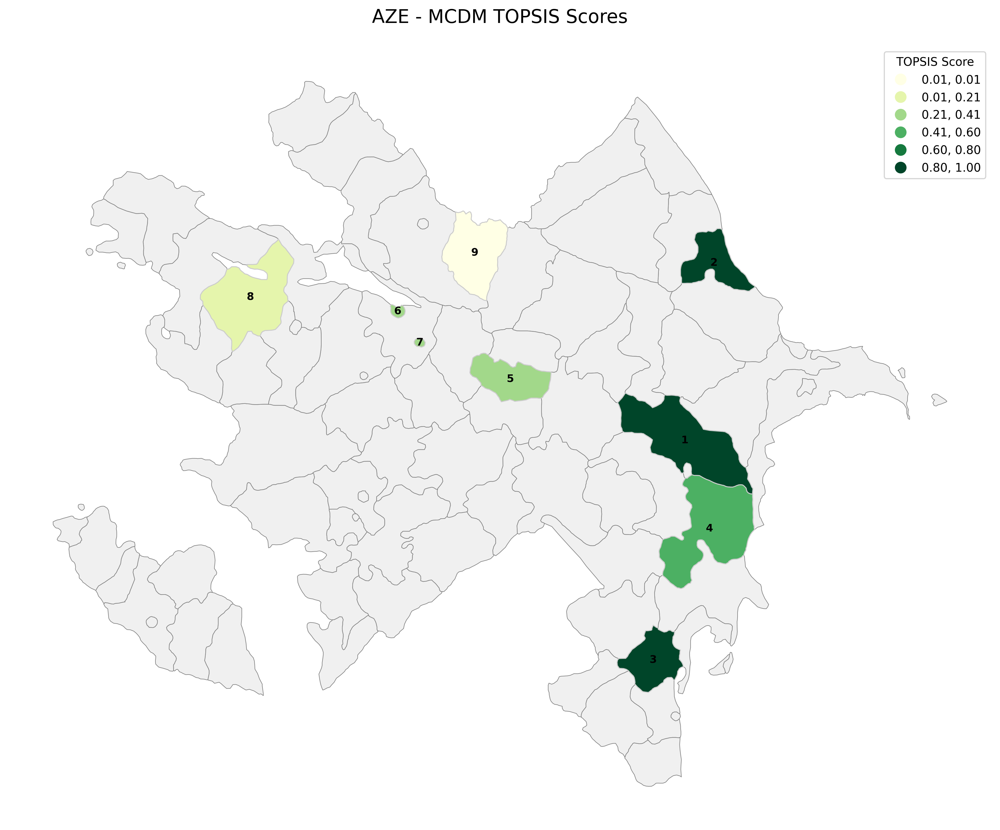
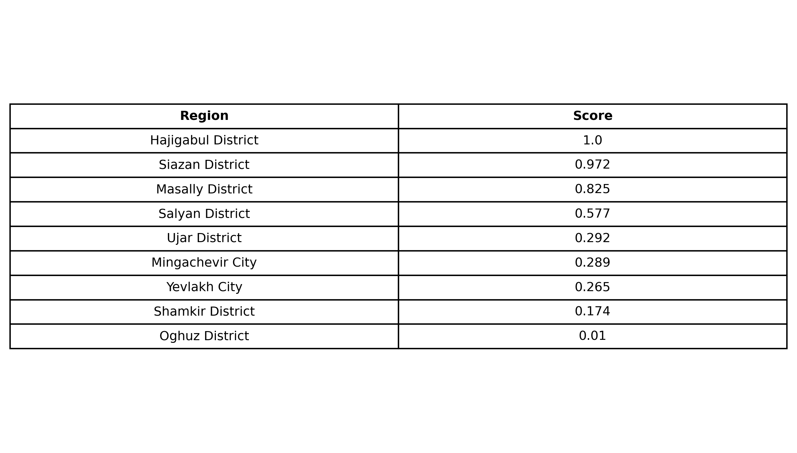

# mcdm-tool  
A lightweight yet powerful Python toolkit for multi-criteria decision making (MCDM), designed for transparent, reproducible, and policy-ready evaluations.

The library supports full decision-analysis workflows used in economic policy, industrial strategy, and investment prioritization — combining AHP, TOPSIS, normalization utilities, sensitivity analysis, and geographic visualization.

---

## Use Cases
- Ranking industrial zones and free economic zones  
- Evaluating SME support programs and public investment proposals  
- Comparing policy alternatives using quantitative evidence  
- Visualizing performance across regions via static or interactive maps  
- Supporting data-driven decision-making in public administration and development economics  

---

## Key Features

### **Criteria & Configuration**
- Define criteria, sub-criteria, and indicator hierarchies  
- Specify benefit vs. cost criteria  
- Excel-based configuration for non-technical users  
- Automatic parsing and validation of category/indicator inputs  

---

### **AHP (Analytic Hierarchy Process)**
- Pairwise comparison matrices  
- Priority vector computation  
- Consistency Ratio (CR) and diagnostic checks  
- Multi-dimension support (e.g., economic, social, environmental pillars)  

---

### **TOPSIS**
- Min–max or vector normalization  
- Benefit/cost direction handling  
- Ideal & anti-ideal distance computation  
- Final ranking with clean score outputs  

---

### **Normalization Utilities**
- Min–max normalization  
- Vector normalization  
- Robust handling of regional decimal separators (`,` vs `.`)  
- Safe parsing of Excel-based indicator values  

---

### **Sensitivity Analysis**
- One-way sensitivity on criteria weights  
- Ranking stability diagnostics  
- Identification of robust and fragile alternatives  

---

### **Visualization**
#### **Static Plots (matplotlib)**  
- Ranked bar charts  
- Contribution charts  
- Sensitivity curves  
- Choropleth maps on administrative boundaries  

#### **Interactive Maps (folium)**  
- Color-coded MCDM scores  
- Hover popups with indicator metadata  
- Auto-generated HTML maps for sharing and embedding  

---

### **Excel & GeoJSON Integration**
- Easy loading of indicators, categories, and pairwise matrices from Excel  
- Support for country-level GeoJSON files  
- Automatic merge of results with regional boundaries  

---

## Installation

> **Note:** The package is currently in active development.  
> To install in editable mode:

```bash
    git clone https://github.com/elvin-alizada/mcdm-tool.git
    cd mcdm-tool
    pip install -e . 
```

## Example Output

### Static Choropleth Map


### TOPSIS Ranking Table


